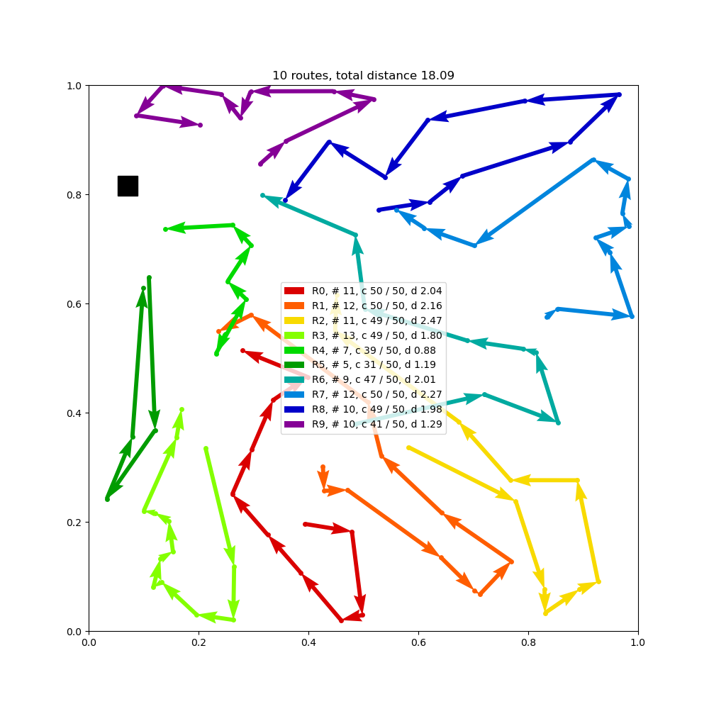

# Analyzing the Vehicle Route Problem: A Heuristic Approach to Route Planning and Optimization

## Introduction
This model incorporates the attention based model from the paper [Attention, Learn to Solve Routing Problems!](https://openreview.net/forum?id=ByxBFsRqYm) which was accepted at [ICLR 2019](https://iclr.cc/Conferences/2019) for learning to solve the Travelling Salesman Problem (TSP) and the Vehicle Routing Problem (VRP), Orienteering Problem (OP) and (Stochastic) Prize Collecting TSP (PCTSP). Training with REINFORCE with greedy rollout baseline.
<br />
<br />
The paper describing this specific extension of the aforementioned model is from the paper [Analyzing the Vehicle Route Problem: A Heuristic Approach to Route Planning and Optimization](readfiles/paper.pdf)
<br />
<br />
Note: All files linked in this README are accessible in the following locations:
* Images are in [images/](images)
* Python scripts are in the root directory
* All other filetypes (PDF, diff, etc.) are in [readfiles/](readfiles)

## Paper
For more details, please see our paper [Analyzing the Vehicle Route Problem: A Heuristic Approach to Route Planning and Optimization](readfiles/paper.pdf).

## Dependencies

* Python>=3.8
* NumPy
* SciPy
* [PyTorch](http://pytorch.org/)>=1.7
* tqdm
* [tensorboard_logger](https://github.com/TeamHG-Memex/tensorboard_logger)
* Matplotlib (optional, only for plotting)

## Differences
To view the differences between the implementation in this codebase, reference [this document](readfiles/compare.pdf) to view pdf that will 
compare the original code with the added code. The greatest changes were made in [plot_vrp.py](plot_vrp.py), [simple_tsp.py](simple_tsp.py),
as well as smaller changes and additions in other locations. Most of the more significant changes that were made by us have a comment 
somewhere near the top indicating that it is original code, but not all changes are indicated in this way.<br />
<br />
A `.diff` file is also available [here](readfiles/differences.diff)

## Running the code
To run the code that demonstrates the implementation described in the paper (which as noted, did not make any real changes to the
sample routes that were being utilized), run the following command in the root folder:
```
python plot_vrp.py
```
The output will be two sets of ten images, one which runs the Capacitated Vehicle Routing Problem (CVRP) ```cvrp_100``` model on 
a graph of 100 nodes, and one which runs this as well as the Traveling Salesman Problem (TSP) ```tsp_100``` model on each
outputted route from the ```cvrp_100``` model. The data for this run is randomly generated within the script, but [generate.py](generate.py) can 
also be used to generate data for testing purposes. For more details, see [the original README file](readfiles/README(Kool).md). An example is shown below: <br />
<br />
CVRP:
<br />

CVRP + TSP on routes:


Observing the two images it is clear that each route is identical, and the distance for each 
route as well as the total distance did not change.<br />
<br />
The [plot_vrp.py](plot_vrp.py) script can be altered in order to apply different versions of the CVRP models as well as different 
versions of the TSP model that is overlayed by following the steps from [the original README file](readfiles/README(Kool).md) which allow
users to generate data, as well as create and train models with specific parameters. If the amount of graph nodes is changed for the new model, this 
must also be adjusted in the [plot_vrp.py](plot_vrp.py) script. 

## Slight improvements with Beam Search

The [run.py](run.py) file has the ability to train models using Beam Search, and this slightly improves the CVRP model as seen
in this image below, which is the output after creating and training a CVRP model for a graph of 20 nodes.<br />

The average cost for a route using a model with beam search is slightly less than it would be when using a model without.


## Acknowledgements

This repository includes adaptions of the following repository as a baseline:
* https://github.com/wouterkool/attention-learn-to-route
